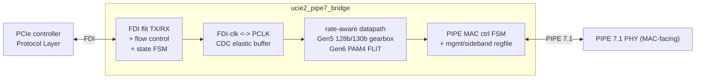

# ucie2-pipe7-bridge

RTL bridge from a **UCIe 2.0 FDI** (Flit-Aware Die-to-Die Interface,
controller-facing) to a **PCIe PIPE 7.1 MAC-facing** interface, verified by two
independently-authored, **cycle-accurate** testbenches (PyUVM-on-cocotb and
SystemVerilog UVM-on-Verilator).

> **Status:** Phase A scaffold. The DUT is a boundary shell (ports + idle
> defaults, no datapath yet); the environment — lint, both DV tiers, the
> cycle-accurate cross-check, container, and CI — is wired and green. The
> datapath is built in Phase B. See **`PLAN.md`** for the full plan and
> **`CLAUDE.md`** for session orientation.

## Architecture (target)



## Layout

| Path | What |
|------|------|
| `rtl/` | SystemVerilog RTL (bridge top + package) |
| `dv/pyuvm/` | PyUVM-on-cocotb tier (runs locally + CI) |
| `dv/uvm/{sv,vlt,vcs}/` | SV UVM env (one class per file, Cookbook-style), Verilator `--binary` flow, VCS mirror |
| `dv/uvm/sv/{fdi_agent,pipe_agent,env,test}/` | per-class UVM sources (agents, env, test) — see below |
| `dv/uvm/sv/ucie2_pipe7_sva.sv` | bound SVA checker on the bridge boundary (see below) |
| `dv/uvm/eda_playground/` | generated paste-ready EDA Playground bundle (`make eda-playground`) |
| `tools/gen_eda_playground.py` | EDA Playground bundle generator + `make eda-check` drift-guard |
| `dv/common/models/` | shared golden model + trace-format contract |
| `tools/trace_compare.py` | cycle-accurate PyUVM-vs-UVM trace diff |
| `tools/coverage_report.py` | `make coverage` report (`[COV] line=NN.N%`, `[COV] branch=NN.N%`) |
| `formal/` | SymbiYosys BMC wrappers + `.sby` jobs (`make formal`, see below) |
| `tools/formal_run.sh`, `tools/formal_prep.py` | `make formal` driver + yosys-frontend source shim |
| `metrics/` | committed metrics store (`schema.sql` @ `user_version = 2`, `metrics.db`) + generated `dashboard.html` |
| `tools/metrics_collect.py`, `tools/metrics_dashboard.py` | `make metrics` row collector, `make dashboard` HTML generator |
| `docs/` | spec cross-check, verification plan |
| `.devcontainer/`, `Dockerfile*`, `.railway/` | Codespaces, containers, Railway |

## Quick start (local, ~8 GB host)

```bash
make lint       # RTL strict lint (Verilator -Wall)
make pyuvm      # PyUVM-on-cocotb tier (needs a cocotb simulator on PATH)

# SV UVM env: LINT ONLY locally (the full --binary build OOMs a small box).
# Needs a UVM-capable Verilator >= 5.050 + its bundled UVM lib (NOT OSS CAD Suite):
make lint-uvm VERILATOR=~/verilator/bin/verilator \
              UVM_HOME=~/verilator/test_regress/t/uvm
```

The heavy gates run in **CI / the Railway container**, not locally:

```bash
make uvm            # full SV UVM --binary build + run   (CI/Railway)
make trace-compare  # cycle-accurate cross-check          (CI/Railway)
```

Two post-gate, additive tiers round it out (never part of the gate):

```bash
make coverage       # [COV] line=NN.N% + [COV] branch=NN.N%  (advisory RTL coverage)
make formal         # [FORMAL] <job>: BMC depth N PASSED   (SymbiYosys BMC)
```

…plus the post-gate metrics store and its offline dashboard:

```bash
make metrics        # [METRICS] regressions: N (advisory) + row #N appended
make dashboard      # [DASH] wrote metrics/dashboard.html (+ per-branch trends)
```

## SV UVM env layout (Cookbook-style)

The SV UVM env is written UVM-Cookbook style — **one class per file**, pulled
into a single package (`dv/uvm/sv/ucie2_pipe7_uvm_pkg.sv`) via ordered
`` `include ``:

```
dv/uvm/sv/
  ucie2_pipe7_if.sv          boundary interface (FROZEN Item-0 signal set)
  ucie2_pipe7_sva.sv         bound SVA checker
  ucie2_pipe7_uvm_pkg.sv     package: localparams + ordered `include list
  tb_ucie2_pipe7.sv          top: clocks/reset, DUT + vif, run_test
  fdi_agent/   fdi_flit_item · fdi_sequencer · fdi_seq_lib · fdi_driver · fdi_monitor · fdi_agent
  pipe_agent/  pipe_monitor (tx) · phy_loopback · pipe_agent
  env/         bridge_scoreboard · bridge_env
  test/        ucie2_roundtrip_test   (the per-cycle trace emitter)
```

One package keeps every shared type (the `fdi_flit_item`, the package
localparams, the virtual interface) in one compilation unit. `test/
ucie2_roundtrip_test.sv` **is the sacred trace emitter**: its `run_phase` forks
the component timing tasks in a fixed order so the emitted per-cycle trace stays
byte-identical to the PyUVM tier and `tools/trace_compare.py` stays green — do
not change its orchestration.

## Run in EDA Playground

`make eda-playground` bundles the DUT + UVM testbench into paste-ready files
under `dv/uvm/eda_playground/` (a `design.sv` + `testbench.sv` pair for the two
panes, plus a single all-in-one file), flattening the UVM package's project
`` `include ``s so no include path is needed. See
`dv/uvm/eda_playground/README.md` for the tool/UVM settings.

```bash
make eda-playground   # [EDA] wrote 3 files … to dv/uvm/eda_playground
make eda-check        # fail if the committed bundle is stale (drift-guard)
```

This bundle is a **portability/demo artifact** — it is not part of the sacred
gate and cannot run `trace_compare`; the byte-identical cross-check lives in CI.

## Line coverage (advisory)

```bash
make coverage        # [COV] line=NN.N% + [COV] branch=NN.N%
                     #   -> build/coverage/{coverage.txt,annotated/}
make coverage COV_MIN=80   # same, but fail below the floor (not enabled yet)
```

`make coverage` re-runs the **directed FDI round-trip** (`dv/pyuvm/test_roundtrip`)
in a *separate* Verilator `--coverage-line` build dir (`dv/pyuvm/cov_build`,
switched on only by `RTL_COVERAGE=1`) and scores it with `tools/coverage_report.py`:
per-instance points are merged by `(file, line)`, only `rtl/` sources count, and
branch points are reported separately (never part of the `line=` number).

It is **additive and outside the gate** — it is not run by `lint`/`pyuvm`/`fcov`/
`uvm`/`trace-compare`, and in CI it is a post-gate step in `uvm-verilator.yml`
(after `trace-compare`, `continue-on-error: true`), so it can never perturb the
byte-identical cross-check.

Measured baseline: **`[COV] line=63.3%` (38/60 RTL lines)** and
**`[COV] branch=75.6%` (34/45 RTL branch points)**. Only the `line=` number is
ever gateable (`COV_MIN`); the `branch=` banner is informational and is what
Phase G increment 1 records as `coverage_branch_pct`. The uncovered lines
are concentrated in `pipe7_msgbus_master.sv` and `pipe7_mac_ctrl_fsm.sv`, which
the loopback round-trip does not drive (the `make fcov` tier sweeps those). The
floor is **advisory (report only)** for now; a `>= NN%` gate is set via `COV_MIN`
once the baseline is agreed — deliberately *not* enabled in this change.

> If a cocotb build here dies with `ModuleNotFoundError: No module named
> 'encodings'`, that is a host quirk unrelated to this repo: cocotb exports
> `PYTHONHOME` for its embedded interpreter, which breaks the `/usr/bin/python3`
> that Verilator's `verilated.mk` hardcodes when the two are different versions.
> Work around it with `make pyuvm PYTHON3="$(command -v python3)"` (same for
> `make coverage`).

## Formal (SymbiYosys BMC, post-gate)

```bash
make formal                       # all jobs
make formal FORMAL_JOBS=pipe7_gearbox   # one job
```

```
[FORMAL] pipe7_gearbox: BMC depth 12 PASSED
[FORMAL] pipe7_mac_ctrl_fsm: BMC depth 24 PASSED
[FORMAL] ucie2_fdi_link_fsm: BMC depth 24 PASSED
[FORMAL] 3 job(s) PASSED (bounded model check -- not an unbounded proof)
```

A **bounded** model check (BMC) of three tractable blocks, driven by
**SymbiYosys** over apt `yosys` + `z3` — *not* OSS CAD Suite. Every DUT input is
free, so each property holds for **all** input sequences up to the stated depth.
This is **not** an unbounded proof: the banner reports `BMC depth N`, and nothing
here is `k`-induction.

The properties live in `formal/*_formal.sv` wrapper modules that only look at the
DUT's **port boundary** — **no RTL is edited** (yosys' Verilog frontend does not
resolve hierarchical references, so no internal signal is poked at either).

| Job | Block(s) | Proved |
|-----|----------|--------|
| `ucie2_fdi_link_fsm` | `rtl/ucie2_fdi_link_fsm.sv` | **No illegal FSM state** — `pl_state_sts` is always a legal `fdi_state_e` (the FLAGGED encoding, cross-check §C) given legal `lp_state_req`; `link_active ⇔ FDI_ACTIVE`; state only moves via `lp_linkerror` or a completed `pl_stallreq`/`lp_stallack` handshake; `pl_stallreq` only rises on a genuinely different request; the rx-active/wake/clk mirrors are exact |
| `pipe7_mac_ctrl_fsm` | `rtl/pipe7_mac_ctrl_fsm.sv` | **PIPE 7.1 §8.4.1 legality** — Rate/Width/RxWidth only ever change out of a cycle that was busy, with TxElecIdle asserted and PowerDown in P0/P1; PowerDown only moves out of an idle `REQ_POWER`; `done`/`req_error` mutually exclusive; `done ⇒ !busy`; `busy` only rises on `req_valid`; `PclkChangeAck` low unless `PCLK_IS_PHY_INPUT` and only after `PclkChangeOk`. Both PCLK parameterizations are proved at once |
| `pipe7_gearbox` | `rtl/pipe7_tx_framer_gb.sv` + `rtl/pipe7_rx_deframer_gb.sv` | **Gen5 gearbox sync legality** — framer never over-accepts (`pl_acc ≤ pl_cnt`) and its accumulator occupancy, re-derived from the observable interface, stays in `[0, ACC_W]` (no overflow, no dropped bits); deframer never reports an illegal `pl_cnt`, never passes a block with an illegal sync header upstream (`sync_error ⇒ pl_cnt == 0`), only errors from a locked state, always drops lock on an error and always gains it on a delivered block |

`make formal` is **additive and outside the gate** — it is never run by
`lint`/`pyuvm`/`fcov`/`uvm`/`trace-compare`/`coverage`, it reads no testbench, and
it writes only under `build/formal/`. It runs in the Railway container image
(the `Dockerfile` runtime stage carries yosys + sby + z3 + click). The matching
**post-gate** CI step for `uvm-verilator.yml` — placed after `trace-compare` and
its artifact upload so it can never perturb the byte-identical cross-check — is
written out in `docs/phase_f_env_enhancements.md` (increment 3) and still needs a
maintainer with `workflows` token scope to apply it. On a host without the formal
tools `make formal` prints a `[FORMAL] SKIP:` line and exits 0.

> `tools/formal_prep.py` writes a mechanically transformed **copy** of the RTL
> into `build/formal/src/` (the apt yosys 0.33 frontend cannot parse
> `import ucie2_pipe7_pkg::*;`, `return` inside a function, or an `int'()` cast).
> `rtl/` is never modified. The `.sby` engine is `smtbmc --unroll z3`: the default
> non-unrolled encoding is pathological for z3 4.8.12 and does not finish.

## Metrics + dashboard (post-gate)

```bash
make metrics      # run the tiers this host can, append ONE row to metrics/metrics.db
make dashboard    # regenerate metrics/dashboard.html from that DB
```

```
[METRICS] lint=pass  pyuvm=pass  fcov=pass  uvm=not-run  trace-compare=not-run  coverage=pass  formal=pass
[METRICS] signals: cov-branch=75.6%  formal-depth<=24 (3 job(s))  roundtrip-cycles=200  peak-rss=132MiB  wall=31.9s
[METRICS] regressions: 0
[METRICS] row #3 appended to metrics/metrics.db (3 row(s), source=measured, sha=b577055, 2026-09-02T21:43:21Z)
[DASH] wrote metrics/dashboard.html (16307 bytes, 3 of 3 row(s), self-contained: no CDN/JS/external fetch)
[DASH] trends: branch swarm/phaseG-metrics-trends (2 run(s)), inline SVG; regressions: 0 (advisory)
```

A small **committed** SQLite store (`metrics/schema.sql` → `metrics/metrics.db`,
one row per `make metrics`) plus a **single self-contained** HTML dashboard —
all CSS inlined, trend sparklines drawn as hand-written inline `<svg>`, **no CDN,
no external fetch, no `<script src>`**. Open `metrics/dashboard.html` by
double-clicking it; it renders fully offline. Everything uses **stdlib Python**
(`sqlite3` module — the `sqlite3` CLI is not required).

Each row records the ISO-8601 UTC timestamp, git short-sha, branch, dirty flag,
env, and per tier (`lint`, `pyuvm`, `fcov`, `uvm`, `trace-compare`, `coverage`,
`formal`) its status, duration and headline number (`[FCOV] bins=H/T`,
`[COV] line=NN.N%`, `[FORMAL] N/N jobs`, trace cycles).

### Schema v2 — extra signals, trends, regression flags

`metrics/schema.sql` is at **`user_version = 2`**. `make metrics` migrates an
older store **in place on first run** (`ALTER TABLE runs ADD COLUMN` per missing
column, then the `CREATE ... IF NOT EXISTS` script) and prints e.g.
`[METRICS] schema migrated v1 -> v2: +10 column(s), 1 existing row(s) preserved`.
**Every existing row survives**; the new columns come up `NULL` / `'none'` —
i.e. "that row never measured this", which is the honest answer.

v2 adds four signals, each with **its own `*_source`** so a number is never
implied by its tier's roll-up:

| signal | column(s) | where it comes from |
|--------|-----------|---------------------|
| coverage **branch %** | `coverage_branch_pct` + `coverage_branch_source` | the new `[COV] branch=NN.N%` banner. Reported **alongside**, never folded into, the gated `[COV] line=` number |
| per-job **formal BMC depth** | `formal_depth_max` + `formal_depth_source`, and the `formal_jobs` side table (`run_id, job, depth, status`) | the existing `[FORMAL] <job>: BMC depth N PASSED` lines. Only measured runs get side-table rows — a depth is never attributed to a job that did not run |
| round-trip **sim cycle count** | `roundtrip_cycles` + `roundtrip_cycles_source` | counted read-only from the per-cycle trace the `pyuvm` tier just wrote. Distinct from `trace_cycles`, which is what `trace-compare` diffed across **both** TBs |
| collect **peak RAM** | `collect_peak_rss_mb` + `collect_source` | `resource.getrusage` `ru_maxrss`, max(self, heaviest child). Wall time stays the pre-existing `total_secs` |

**Trends.** The dashboard's chart row plots the history of the **latest row's
branch only** (a feature branch is never silently compared against `main`), and
plots **measured points only** — a carried-forward value leaves a gap rather than
faking a data point. Ten sparklines: line/branch/functional coverage, formal BMC
depth, round-trip cycles, `lint`/`pyuvm`/`fcov` runtimes, collect wall time and
peak RSS. All drawn by `tools/metrics_dashboard.py` as inline `<svg>` polylines —
still no chart library and no CDN.

**Regression flags — advisory, never a gate.** Each measured signal is compared
with the most recent prior row on the same branch that measured *that same
signal*. A flag is raised when a tier goes **pass→fail**, when
coverage/BMC-depth/cycle-count **drops**, or when a tier runtime **both at least
doubled and grew ≥ 5 s** (so a 0.09 s → 0.20 s `lint` blip is never reported).
The count is printed as `[METRICS] regressions: N`, stored on the row
(`regressions`, `regression_notes`) and badged in the dashboard. It **never**
changes the exit status of `make metrics`/`make dashboard`, and no gate reads it.
Rows written before v2 show `—` / "regressions n/a" rather than a fabricated `0`.

**Measured vs estimated is never blurred.** Every tier carries its own `*_source`:

| `*_source` | meaning |
|-----------|---------|
| `measured` | the tier ran for this row (or its banner was read from the log the gate just wrote, e.g. `dv/uvm/vlt/obj/run.log`) — the numbers are its own output |
| `estimated` | carried forward from an older measured row by `make metrics METRICS_ARGS=--carry-forward` (**off by default**) — flagged in the DB, starred in the banner and badged in the dashboard, and never presented as a measurement of this commit |
| `none` | the tier did not run; status is `not-run` |

A tier that cannot run on a host (tool absent, or the `--binary` UVM flow that
needs the from-source Verilator) is recorded **`not-run`, never `fail`**, and no
number is invented for it. Tune what runs with
`make metrics METRICS_TIERS=lint,pyuvm` (default:
`lint,pyuvm,fcov,coverage,formal,trace-compare`; `uvm` is never rebuilt — its
result is read from the gate's own `run.log` when present, and `trace-compare` is
recorded `not-run` unless both TB traces are on disk). Per-tier logs are tee'd to
`build/metrics/<tier>.log` (git-ignored).

Both targets are **additive and outside the gate**: they are not run by
`lint`/`pyuvm`/`fcov`/`uvm`/`trace-compare`/`coverage`/`formal`, they touch no
RTL, no testbench, no trace emitter and no clock/reset/stimulus schedule — they
only invoke the existing targets unmodified and parse their banners. The matching
**post-gate, `continue-on-error`** CI step for `uvm-verilator.yml` (last step,
after the coverage steps, uploading `dashboard.html` as an artifact) is written
out in `docs/phase_f_env_enhancements.md` (increment 4) and still needs a
maintainer with `workflows` token scope to apply it.

## Bound assertions (SVA)

`dv/uvm/sv/ucie2_pipe7_sva.sv` is a logic-free checker module `bind`-ed onto every
`ucie2_pipe7_bridge` instance — **no RTL edits**. It asserts, per cycle:

| Assertion | Property |
|-----------|----------|
| `a_no_tx_while_elec_idle` | `tx_data_valid` is never high while `tx_elec_idle` is asserted (qualified `!busy`) |
| `a_lock_is_sticky` | `block_locked` never drops without `sync_error` |
| `a_no_sync_error_once_locked` | no `sync_error` in steady state once `block_locked` |
| `a_stallreq_held_until_ack` | `pl_stallreq` is held until `lp_stallack` (or `lp_linkerror`) |
| `a_state_change_handshaked` | `pl_state_sts` only changes via a completed stall handshake |
| `a_no_rx_overflow` | `rx_overflow` never asserts in the directed round-trip |

It rides the existing SV UVM flow: `make lint-uvm` elaborates it and the CI/Railway
`make uvm` (`--binary`) **checks** it — `dv/uvm/vlt/Makefile` passes `--assert` and
fails the run on any `[SVA]` line in `obj/run.log`. It is intentionally **not** in
`rtl/`, so the root `make lint`, `make pyuvm` and `make fcov` source lists (which
glob `rtl/*.sv`) and the byte-identical cross-check trace are unaffected.

## Toolchain policy

This project **does not use OSS CAD Suite.** The reproducible environments
(`.devcontainer/`, `Dockerfile*`, CI) install apt `verilator`/`iverilog` for lint
and the PyUVM tier, and build a **UVM-capable Verilator ≥ 5.050 from source** for
the SV UVM `--binary` gate. Locally the Makefile takes `VERILATOR`/`IVERILOG`
overrides so it runs with whatever is on your PATH.

## Codespaces

`.devcontainer/devcontainer.json` builds `Dockerfile.dev` (apt tools + a
cocotb 1.x venv) and, on create, runs `make lint`. Run the PyUVM tier in the
Codespace with `make pyuvm` (the image ships a cocotb/Verilator combo that works
together — apt Verilator is 5.020, so cocotb is pinned to 1.x). Enable
**prebuilds** in the repo's Settings → Codespaces so a new Codespace starts with
the image and caches warm.

## Railway

`.railway/railway.ts` runs the SV UVM gate as a batch job (no listening port).
See `.railway/README.md`.
