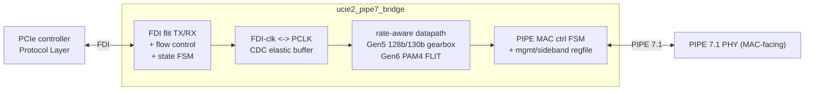

# ucie2-pipe7-bridge

RTL bridge from a **UCIe 2.0 FDI** (Flit-Aware Die-to-Die Interface,
controller-facing) to a **PCIe PIPE 7.1 MAC-facing** interface, verified by two
independently-authored, **cycle-accurate** testbenches (PyUVM-on-cocotb and
SystemVerilog UVM-on-Verilator).

> **Status:** Phase A scaffold. The DUT is a boundary shell (ports + idle
> defaults, no datapath yet); the environment — lint, both DV tiers, the
> cycle-accurate cross-check, container, and CI — is wired and green. The
> datapath is built in Phase B. See **`PLAN.md`** for the full plan and
> **`CLAUDE.md`** for session orientation.

## Architecture (target)



## Layout

| Path | What |
|------|------|
| `rtl/` | SystemVerilog RTL (bridge top + package) |
| `dv/pyuvm/` | PyUVM-on-cocotb tier (runs locally + CI) |
| `dv/uvm/{sv,vlt,vcs}/` | SV UVM env, Verilator `--binary` flow, VCS mirror |
| `dv/common/models/` | shared golden model + trace-format contract |
| `tools/trace_compare.py` | cycle-accurate PyUVM-vs-UVM trace diff |
| `docs/` | spec cross-check, verification plan |
| `.devcontainer/`, `Dockerfile*`, `.railway/` | Codespaces, containers, Railway |

## Quick start (local, ~8 GB host)

```bash
make lint       # RTL strict lint (Verilator -Wall)
make pyuvm      # PyUVM-on-cocotb tier (needs a cocotb simulator on PATH)

# SV UVM env: LINT ONLY locally (the full --binary build OOMs a small box).
# Needs a UVM-capable Verilator >= 5.050 + its bundled UVM lib (NOT OSS CAD Suite):
make lint-uvm VERILATOR=~/verilator/bin/verilator \
              UVM_HOME=~/verilator/test_regress/t/uvm
```

The heavy gates run in **CI / the Railway container**, not locally:

```bash
make uvm            # full SV UVM --binary build + run   (CI/Railway)
make trace-compare  # cycle-accurate cross-check          (CI/Railway)
```

## Toolchain policy

This project **does not use OSS CAD Suite.** The reproducible environments
(`.devcontainer/`, `Dockerfile*`, CI) install apt `verilator`/`iverilog` for lint
and the PyUVM tier, and build a **UVM-capable Verilator ≥ 5.050 from source** for
the SV UVM `--binary` gate. Locally the Makefile takes `VERILATOR`/`IVERILOG`
overrides so it runs with whatever is on your PATH.

## Codespaces

`.devcontainer/devcontainer.json` builds `Dockerfile.dev` (apt tools + a
cocotb 1.x venv) and, on create, runs `make lint`. Run the PyUVM tier in the
Codespace with `make pyuvm` (the image ships a cocotb/Verilator combo that works
together — apt Verilator is 5.020, so cocotb is pinned to 1.x). Enable
**prebuilds** in the repo's Settings → Codespaces so a new Codespace starts with
the image and caches warm.

## Railway

`.railway/railway.ts` runs the SV UVM gate as a batch job (no listening port).
See `.railway/README.md`.
