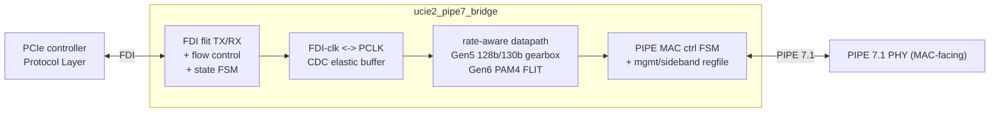

# ucie2-pipe7-bridge

RTL bridge from a **UCIe 2.0 FDI** (Flit-Aware Die-to-Die Interface,
controller-facing) to a **PCIe PIPE 7.1 MAC-facing** interface, verified by two
independently-authored, **cycle-accurate** testbenches (PyUVM-on-cocotb and
SystemVerilog UVM-on-Verilator).

> **Status:** Phase A scaffold. The DUT is a boundary shell (ports + idle
> defaults, no datapath yet); the environment — lint, both DV tiers, the
> cycle-accurate cross-check, container, and CI — is wired and green. The
> datapath is built in Phase B. See **`PLAN.md`** for the full plan and
> **`CLAUDE.md`** for session orientation.

## Architecture (target)



## Layout

| Path | What |
|------|------|
| `rtl/` | SystemVerilog RTL (bridge top + package) |
| `dv/pyuvm/` | PyUVM-on-cocotb tier (runs locally + CI) |
| `dv/harness/` | back-to-back (B2B) wrapper tops: two bridges joined at PIPE / at FDI (`make b2b`) |
| `dv/uvm/sv/b2b/` | SV UVM tier for the B2B configs (interfaces, drivers, monitors, scoreboards, tops) |
| `dv/uvm/{sv,vlt,vcs}/` | SV UVM env (one class per file, Cookbook-style), Verilator `--binary` flow, VCS mirror |
| `dv/uvm/sv/{fdi_agent,pipe_agent,env,test}/` | per-class UVM sources (agents, env, test) — see below |
| `dv/uvm/sv/ucie2_pipe7_sva.sv` | bound SVA checker on the bridge boundary (see below) |
| `dv/uvm/eda_playground/` | generated paste-ready EDA Playground bundle (`make eda-playground`) |
| `tools/gen_eda_playground.py` | EDA Playground bundle generator + `make eda-check` drift-guard |
| `dv/common/models/` | shared golden model + trace-format contract |
| `tools/trace_compare.py` | cycle-accurate PyUVM-vs-UVM trace diff |
| `tools/coverage_report.py` | `make coverage` report (`[COV] line=NN.N%`, `[COV] branch=NN.N%`) |
| `dv/waves/` | curated GTKWave layouts (`default.gtkw`) — **committed**; the dumps are not |
| `dv/waves/viewer/wave_viewer.html` | vendored self-contained browser waveform viewer (the `make wave-web` template) |
| `tools/wave_check.py` | `make wave-check` layout drift-guard (`fst2vcd`-resolved net paths) |
| `tools/wave_web.py` | `make wave-web` bundler: dump + viewer → one offline HTML file |
| `formal/` | SymbiYosys BMC wrappers + `.sby` jobs (`make formal`, see below) |
| `tools/formal_run.sh`, `tools/formal_prep.py` | `make formal` driver + yosys-frontend source shim |
| `metrics/` | committed metrics store (`schema.sql` @ `user_version = 2`, `metrics.db`) + generated `dashboard.html` |
| `tools/metrics_collect.py`, `tools/metrics_dashboard.py` | `make metrics` row collector, `make dashboard` HTML generator |
| `docs/` | spec cross-check, verification plan |
| `.devcontainer/`, `Dockerfile*`, `.railway/` | Codespaces, containers, Railway |

## Quick start (local, ~8 GB host)

```bash
make lint       # RTL strict lint (Verilator -Wall)
make pyuvm      # PyUVM-on-cocotb tier (default round-trip; needs a cocotb simulator)

# The default round-trip test drives a SEEDED-RANDOM flit sequence of adjustable
# length. Both testbenches read ONE generated vector (dv/common/vectors/build/), so
# the cycle-accurate cross-check stays byte-identical. Knobs:
make pyuvm LEN=64              # 64 random flits (default 8)
make pyuvm SEED=42            # a different fixed sequence (default seed 0xC0FFEE)
make pyuvm SEED=random       # a fresh sequence each run (prints the seed)
make pyuvm PROFILE=ramp      # the directed 0x1000+i / 0xABCD0000+i ramp (regression)
# The FDI driver honors pl_trdy backpressure, so any length round-trips without
# dropping flits; RUN_PCLK (trace/drain cycles) auto-scales with LEN.

make b2b        # back-to-back two-bridge configs (PyUVM) — see "Back-to-back" below
make b2b LEN=64 # same LEN/SEED/PROFILE knobs as the single-bridge round-trip

# SV UVM env: LINT ONLY locally (the full --binary build OOMs a small box).
# Needs a UVM-capable Verilator >= 5.050 + its bundled UVM lib (NOT OSS CAD Suite):
make lint-uvm VERILATOR=~/verilator/bin/verilator \
              UVM_HOME=~/verilator/test_regress/t/uvm
```

The heavy gates run in **CI / the Railway container**, not locally:

```bash
make uvm            # full SV UVM --binary build + run   (CI/Railway)
make trace-compare  # cycle-accurate cross-check          (CI/Railway)
```

Two post-gate, additive tiers round it out (never part of the gate):

```bash
make coverage       # [COV] line=NN.N% + [COV] branch=NN.N%  (advisory RTL coverage)
make formal         # [FORMAL] <job>: BMC depth N PASSED   (SymbiYosys BMC)
```

…and, off the gate entirely, waveforms (see "Waveform debugging" below):

```bash
make waves          # [WAVES] wrote build/waves/test_roundtrip.fst
make wave           # same, then open it in GTKWave with dv/waves/default.gtkw
make wave-check     # [WAVES] wave-check: … every path resolves
make wave-web       # bundle that same dump into ONE offline build/waves/*.html
```

…plus the post-gate metrics store and its offline dashboard:

```bash
make metrics        # [METRICS] regressions: N (advisory) + row #N appended
make dashboard      # [DASH] wrote metrics/dashboard.html (trends, filter/sort,
                    #        per-tier drill-down, git_sha → commit links)
```

## Back-to-back (B2B) two-bridge configs

Beyond the single-bridge round-trip, two `ucie2_pipe7_bridge` instances can be
wired **back-to-back** so a payload traverses a *complete* protocol hop through a
real seam instead of the PHY self-loopback. A thin wrapper top in `dv/harness/`
does the join (cocotb needs one TOPLEVEL); the PyUVM tests reuse the shared
stimulus vector, so `LEN` / `SEED` / `PROFILE` apply exactly as for `make pyuvm`.

```bash
make b2b-ucie   # UCIe → [bridge A] → PCIe ══ PCIe → [bridge B] → UCIe
make b2b-pcie   # PCIe → [bridge A] → UCIe ══ UCIe → [bridge B] → PCIe
make b2b        # both
```

| Config | Wrapper | Join (middle) | External ends | Stimulus / observation |
|--------|---------|---------------|---------------|------------------------|
| `b2b-ucie` | `b2b_ucie_pcie_ucie.sv` | **PCIe** link (A.tx_data → B.rx_data) | UCIe/FDI | drive FDI flits into A; recover FDI flits out of B |
| `b2b-pcie` | `b2b_pcie_ucie_pcie.sv` | **UCIe** FDI seam (A.pl_data → B.lp_data) | PCIe/PIPE | inject a framed PIPE word stream into A.rx_data; recover the re-framed stream out of B.tx_data |

Each also has a **full-duplex** variant — `make b2b-ucie-fd` / `make b2b-pcie-fd`
(both folded into `make b2b`) — driving and checking **both directions at once**
over the joined link (PyUVM tier; verified LEN=8/32). The base configs below are
**unidirectional (A→B)**; the
`b2b-pcie` config exercises the RX-inject path flagged in `PLAN.md` §2 — a legal,
block-aligned PIPE word stream (the independent Python framer's output) is played
straight into a bridge's deframer.

Each config uses its own `SIM_BUILD` (`dv/pyuvm/b2b_{ucie,pcie}_build/`), so it
never collides with the single-bridge `sim_build` or the other config. The
cross-check is a **PyUVM scoreboard** (round-trip identity + independent
framing-model agreement + deframer health).

**SV UVM tier** (`dv/uvm/sv/b2b/`) — a second, independent implementation of both
configs, Cookbook-style one-class-per-file, each with its own interface / driver /
monitors / scoreboard / top. Same local/CI split as the single-bridge UVM tier:

```bash
make lint-b2b-uvm   # elaborate-only, both configs        [local, RAM-safe]
make uvm-b2b        # full --binary build + run, both      [CI / Railway]
```

Both tiers read the **same shared vectors**: `+VEC` (flits) for the UCIe config,
and a `+VEC_WORDS` framed PIPE word stream for the PCIe config — the SV side has no
framer, so `make gen-vectors` emits that stream from the shared `framing_model`
(single source of truth), and the PyUVM PCIe test reads the identical file. A
byte-identical PyUVM↔SV-UVM per-cycle trace gate for these configs is deferred
(PLAN Phase H3); the B2B tier is scoreboard-gated in both TBs for now.

## SV UVM env layout (Cookbook-style)

The SV UVM env is written UVM-Cookbook style — **one class per file**, pulled
into a single package (`dv/uvm/sv/ucie2_pipe7_uvm_pkg.sv`) via ordered
`` `include ``:

```
dv/uvm/sv/
  ucie2_pipe7_if.sv          boundary interface (FROZEN Item-0 signal set)
  ucie2_pipe7_sva.sv         bound SVA checker
  ucie2_pipe7_uvm_pkg.sv     package: localparams + ordered `include list
  tb_ucie2_pipe7.sv          top: clocks/reset, DUT + vif, run_test
  fdi_agent/   fdi_flit_item · fdi_sequencer · fdi_seq_lib · fdi_driver · fdi_monitor · fdi_agent
  pipe_agent/  pipe_monitor (tx) · phy_loopback · pipe_agent
  env/         bridge_scoreboard · bridge_env
  test/        ucie2_roundtrip_test   (the per-cycle trace emitter)
```

One package keeps every shared type (the `fdi_flit_item`, the package
localparams, the virtual interface) in one compilation unit. `test/
ucie2_roundtrip_test.sv` **is the sacred trace emitter**: its `run_phase` forks
the component timing tasks in a fixed order so the emitted per-cycle trace stays
byte-identical to the PyUVM tier and `tools/trace_compare.py` stays green — do
not change its orchestration.

## Run in EDA Playground

`make eda-playground` bundles the DUT + UVM testbench into paste-ready files
under `dv/uvm/eda_playground/` (a `design.sv` + `testbench.sv` pair for the two
panes, plus a single all-in-one file), flattening the UVM package's project
`` `include ``s so no include path is needed. See
`dv/uvm/eda_playground/README.md` for the tool/UVM settings.

```bash
make eda-playground   # [EDA] wrote 3 files … to dv/uvm/eda_playground
make eda-check        # fail if the committed bundle is stale (drift-guard)
```

This bundle is a **portability/demo artifact** — it is not part of the sacred
gate and cannot run `trace_compare`; the byte-identical cross-check lives in CI.

## Line coverage (advisory)

```bash
make coverage        # [COV] line=NN.N% + [COV] branch=NN.N%
                     #   -> build/coverage/{coverage.txt,annotated/}
make coverage COV_MIN=80   # same, but fail below the floor (not enabled yet)
```

`make coverage` re-runs the **directed FDI round-trip** (`dv/pyuvm/test_roundtrip`)
in a *separate* Verilator `--coverage-line` build dir (`dv/pyuvm/cov_build`,
switched on only by `RTL_COVERAGE=1`) and scores it with `tools/coverage_report.py`:
per-instance points are merged by `(file, line)`, only `rtl/` sources count, and
branch points are reported separately (never part of the `line=` number).

It is **additive and outside the gate** — it is not run by `lint`/`pyuvm`/`fcov`/
`uvm`/`trace-compare`, and in CI it is a post-gate step in `uvm-verilator.yml`
(after `trace-compare`, `continue-on-error: true`), so it can never perturb the
byte-identical cross-check.

Measured baseline: **`[COV] line=63.3%` (38/60 RTL lines)** and
**`[COV] branch=75.6%` (34/45 RTL branch points)**. Only the `line=` number is
ever gateable (`COV_MIN`); the `branch=` banner is informational and is what
Phase G increment 1 records as `coverage_branch_pct`. The uncovered lines
are concentrated in `pipe7_msgbus_master.sv` and `pipe7_mac_ctrl_fsm.sv`, which
the loopback round-trip does not drive (the `make fcov` tier sweeps those). The
floor is **advisory (report only)** for now; a `>= NN%` gate is set via `COV_MIN`
once the baseline is agreed — deliberately *not* enabled in this change.

> If a cocotb build here dies with `ModuleNotFoundError: No module named
> 'encodings'`, that is a host quirk unrelated to this repo: cocotb exports
> `PYTHONHOME` for its embedded interpreter, which breaks the `/usr/bin/python3`
> that Verilator's `verilated.mk` hardcodes when the two are different versions.
> Work around it with `make pyuvm PYTHON3="$(command -v python3)"` (same for
> `make coverage`).

## Waveform debugging (off-gate)

```bash
make waves                  # dump build/waves/test_roundtrip.fst
make waves TEST=smoke       # …of a different test (dv/pyuvm/test_<TEST>.py)
make wave                   # dump, then open it in GTKWave with the layout
make wave-check             # drift-guard: every committed layout still resolves
make wave-web               # bundle that dump into ONE offline HTML file
```

```
[WAVES] wrote build/waves/test_roundtrip.fst (9597 bytes) from dv/pyuvm MODULE=test_roundtrip (Verilator FST, -DWAVES build)
[WAVES] open with: make wave TEST=roundtrip   layout: dv/waves/default.gtkw
[WAVES] wave-check: 1 layout(s), 50 net path(s), 1 dump(s) — every path resolves (hierarchy read with fst2vcd)
[WAVES] wrote build/waves/test_roundtrip.html (256304 bytes) — single self-contained file: inlined viewer + base64 VCD, 0 external resource ref(s) [none]
```

**Dumping is strictly opt-in and cannot reach the gate.** FST tracing is compiled
in only by the `ifeq ($(WAVES),1)` block in `dv/pyuvm/Makefile`, which only the
`waves`/`wave`/`wave-check` targets set. That block adds `-DWAVES --trace-fst
--trace-structs` to `COMPILE_ARGS` (compile only) and `--trace --trace-file …` to
`SIM_ARGS` (run only), and redirects the build into its own `dv/pyuvm/wave_build/`
— the same trick `RTL_COVERAGE=1` uses for `cov_build/`. A gate build therefore
still compiles with `VM_TRACE=0`, writes no dump, needs no GTKWave, and emits a
**byte-identical** `dv/pyuvm/build/bridge.trace`.

> Phase G increment 3 also **removed a wave leak from the gate**: `--trace` used
> to sit in the unconditional Verilator `EXTRA_ARGS`, and cocotb appends
> `EXTRA_ARGS` to *both* the verilate command *and* the simulation command — so
> every `make pyuvm` / `make fcov` silently compiled the VCD tracer in and wrote a
> ~170 KB `dv/pyuvm/dump.vcd`. The gate is wave-free again (and a little faster).

`dv/waves/` holds one **curated** GTKWave layout per debug target — start from
`dv/waves/default.gtkw`, which groups the round-trip end to end (FDI in → link
FSM → ingress → Gen5 framer → PIPE TX → loopback → PIPE RX → deframer → egress →
FDI out, plus MAC control and bridge status). `make wave` picks
`dv/waves/<TEST>.gtkw` if it exists and falls back to `default.gtkw`. The layouts
are committed; the **dumps** (`build/waves/*.fst`, `dv/pyuvm/wave_build/`) are
git-ignored build artifacts.

`make wave-check` is the drift-guard that keeps a curated layout from rotting: it
builds the target's dump if needed, reads that dump's **real** hierarchy with apt
GTKWave's `fst2vcd`, and fails naming `file:line` for any net path that no longer
resolves (or whose bit range moved). It is **dev-only and never on the gate**, and
it **skips with exit 0** — rather than claiming a pass — where `fst2vcd` is not
installed.

```
[WAVES] dv/waves/default.gtkw:126: dead net path 'ucie2_pipe7_bridge.link.state_qq[3:0]' — not in build/waves/test_roundtrip.fst
[WAVES] dv/waves/default.gtkw:127: 'tx_data' exists but its range [63:0] does not — dump has ['[79:0]']
[WAVES] wave-check FAILED: 2 dead path(s) in 1 layout(s) — re-curate them against a fresh `make waves` dump
```

Note that cocotb's Verilator main constructs the model as `new Vtop("")`, so the
dump's root scope is **unnamed**: a top-level port is `pclk`, not `TOP.pclk`, and
DUT internals are `ucie2_pipe7_bridge.<inst>.<net>`. `tools/wave_check.py` builds
paths the same way, which is why the committed layout and the checker agree.

To **re-curate** a layout, let GTKWave itself write it (so the names are exactly
what GTKWave resolves) — headless if you have no display:

```bash
make waves
xvfb-run -a gtkwave -a dv/waves/default.gtkw -S my_layout.tcl \
  build/waves/test_roundtrip.fst   # tcl: addSignalsFromList + /File/Write_Save_File
make wave-check                    # then re-prove it
```

Toolchain: Verilator's own FST writer + **apt `gtkwave`** (`Dockerfile.dev`, which
`.devcontainer/` builds, and the root `Dockerfile` for `fst2vcd`) — **not** OSS CAD
Suite. Opening the GUI needs a display; `make wave-check` is the automatable half.

### Browser viewer — `make wave-web` (no desktop app, no X11)

GTKWave needs a display, which a Codespace does not have. `make wave-web` bundles
**the same `-DWAVES` dump** into a single self-contained HTML file you just open:

```bash
make waves && make wave-web        # -> build/waves/test_roundtrip.html
make wave-web TEST=smoke           # builds the dump itself if it is missing
```

```
[WAVES] wrote build/waves/test_roundtrip.html (256304 bytes) — single self-contained file: inlined viewer + base64 VCD, 0 external resource ref(s) [none]
[WAVES] source dump build/waves/test_roundtrip.fst (9597 bytes, the -DWAVES FST from `make waves`) -> 170712 bytes of VCD, 50 default signal(s) from dv/waves/default.gtkw
[WAVES] open it in a browser — offline, no CDN, no external fetch: file:///…/build/waves/test_roundtrip.html
```

- **One file, and it works offline.** Everything is inside it: the viewer's CSS
  and JS inline, and the waveform itself as base64. No CDN, no stylesheet link,
  no external script, no web font, no image, no async request. Copy it anywhere,
  attach it to an issue, open it with the network off.
- **That claim is checked, not asserted.** `tools/wave_web.py` re-scans the file
  it just wrote for every construct that would make a browser load something
  (using the same scanner as `make dashboard`) and prints the count — and
  **fails** if it is not zero, so a viewer that ever grew a CDN reference could
  not ship.
- **It is a small VCD viewer, not a WASM one — deliberately.** A vendored Surfer
  WASM build would be a multi-megabyte binary blob in the repo that nobody here
  can review; `dv/waves/viewer/wave_viewer.html` is a few hundred lines of
  dependency-free ES5 you can read. It gives you a signal tree with a filter, a
  waveform canvas (1-bit square waves, buses as hexagons with values, x/z
  highlighted), zoom/pan/fit, a click cursor plus a shift-click marker with Δ,
  a value-at-cursor column and hex/bin/udec radix. It is **not** GTKWave: no
  bundles, no expressions, no saved layouts, no analog traces. When you have a
  display, `make wave` is still the better tool.
- **No second dump path.** The FST is exactly the one `make waves` wrote; the
  conversion to VCD happens once, at bundle time, with apt GTKWave's `fst2vcd`
  (already an increment-3 dependency). The gate never sees any of it.
- **The default view is the curated layout.** It reuses `dv/waves/<TEST>.gtkw`
  (else `default.gtkw`) via the same reader `make wave-check` uses, so the page
  opens on the same 50 signals GTKWave would; `clear` / `default` and the tree
  let you change it. Group rows are not carried over — the viewer has no group
  concept.
- Output is git-ignored (`build/waves/`); the **template** is committed. Opening
  the template directly just says "no waveform bundled — run `make wave-web`".
- Large dumps: the VCD is inlined, so `--max-mb` (default 64) refuses to build a
  bundle that would no longer be one comfortably-openable file.

**Not yet extended to the SV UVM env.** `make waves-uvm` / `make wave-uvm` are
deliberately deferred: that flow needs the from-source UVM Verilator, which
neither this host nor the light CI job has, so a `$dumpfile` hook there could not
be built, run or proven. See `docs/phase_g_env_enhancements.md` (increment 3,
"Deferred").

## Formal (SymbiYosys BMC, post-gate)

```bash
make formal                       # all jobs
make formal FORMAL_JOBS=pipe7_gearbox   # one job
```

```
[FORMAL] pipe7_gearbox: BMC depth 12 PASSED
[FORMAL] pipe7_mac_ctrl_fsm: BMC depth 24 PASSED
[FORMAL] ucie2_fdi_link_fsm: BMC depth 24 PASSED
[FORMAL] 3 job(s) PASSED (bounded model check -- not an unbounded proof)
```

A **bounded** model check (BMC) of three tractable blocks, driven by
**SymbiYosys** over apt `yosys` + `z3` — *not* OSS CAD Suite. Every DUT input is
free, so each property holds for **all** input sequences up to the stated depth.
This is **not** an unbounded proof: the banner reports `BMC depth N`, and nothing
here is `k`-induction.

The properties live in `formal/*_formal.sv` wrapper modules that only look at the
DUT's **port boundary** — **no RTL is edited** (yosys' Verilog frontend does not
resolve hierarchical references, so no internal signal is poked at either).

| Job | Block(s) | Proved |
|-----|----------|--------|
| `ucie2_fdi_link_fsm` | `rtl/ucie2_fdi_link_fsm.sv` | **No illegal FSM state** — `pl_state_sts` is always a legal `fdi_state_e` (the FLAGGED encoding, cross-check §C) given legal `lp_state_req`; `link_active ⇔ FDI_ACTIVE`; state only moves via `lp_linkerror` or a completed `pl_stallreq`/`lp_stallack` handshake; `pl_stallreq` only rises on a genuinely different request; the rx-active/wake/clk mirrors are exact |
| `pipe7_mac_ctrl_fsm` | `rtl/pipe7_mac_ctrl_fsm.sv` | **PIPE 7.1 §8.4.1 legality** — Rate/Width/RxWidth only ever change out of a cycle that was busy, with TxElecIdle asserted and PowerDown in P0/P1; PowerDown only moves out of an idle `REQ_POWER`; `done`/`req_error` mutually exclusive; `done ⇒ !busy`; `busy` only rises on `req_valid`; `PclkChangeAck` low unless `PCLK_IS_PHY_INPUT` and only after `PclkChangeOk`. Both PCLK parameterizations are proved at once |
| `pipe7_gearbox` | `rtl/pipe7_tx_framer_gb.sv` + `rtl/pipe7_rx_deframer_gb.sv` | **Gen5 gearbox sync legality** — framer never over-accepts (`pl_acc ≤ pl_cnt`) and its accumulator occupancy, re-derived from the observable interface, stays in `[0, ACC_W]` (no overflow, no dropped bits); deframer never reports an illegal `pl_cnt`, never passes a block with an illegal sync header upstream (`sync_error ⇒ pl_cnt == 0`), only errors from a locked state, always drops lock on an error and always gains it on a delivered block |

`make formal` is **additive and outside the gate** — it is never run by
`lint`/`pyuvm`/`fcov`/`uvm`/`trace-compare`/`coverage`, it reads no testbench, and
it writes only under `build/formal/`. It runs in the Railway container image
(the `Dockerfile` runtime stage carries yosys + sby + z3 + click). The matching
**post-gate** CI step for `uvm-verilator.yml` — placed after `trace-compare` and
its artifact upload so it can never perturb the byte-identical cross-check — is
written out in `docs/phase_f_env_enhancements.md` (increment 3) and still needs a
maintainer with `workflows` token scope to apply it. On a host without the formal
tools `make formal` prints a `[FORMAL] SKIP:` line and exits 0.

> `tools/formal_prep.py` writes a mechanically transformed **copy** of the RTL
> into `build/formal/src/` (the apt yosys 0.33 frontend cannot parse
> `import ucie2_pipe7_pkg::*;`, `return` inside a function, or an `int'()` cast).
> `rtl/` is never modified. The `.sby` engine is `smtbmc --unroll z3`: the default
> non-unrolled encoding is pathological for z3 4.8.12 and does not finish.

## Metrics + dashboard (post-gate)

```bash
make metrics      # run the tiers this host can, append ONE row to metrics/metrics.db
make dashboard    # regenerate metrics/dashboard.html from that DB
```

```
[METRICS] lint=pass  pyuvm=pass  fcov=pass  uvm=not-run  trace-compare=not-run  coverage=pass  formal=pass
[METRICS] signals: cov-branch=75.6%  formal-depth<=24 (3 job(s))  roundtrip-cycles=200  peak-rss=253MiB  wall=54.9s
[METRICS] regressions: 0
[METRICS] row #4 appended to metrics/metrics.db (4 row(s), source=measured, sha=b647b69, 2026-09-03T05:41:07Z)
[DASH] wrote metrics/dashboard.html (39398 bytes, 4 of 4 row(s), self-contained: inline CSS/JS/SVG, 0 external resource ref(s))
[DASH] trends: branch swarm/phaseG-metrics-autocommit (1 run(s)), inline SVG; regressions: 0 (advisory)
[DASH] ux: filter+sort over 4 row(s), 7 tier drill-down(s), commit links -> https://github.com/markrthomas/ucie2-pipe7-bridge
```

A small **committed** SQLite store (`metrics/schema.sql` → `metrics/metrics.db`,
one row per `make metrics`) plus a **single self-contained** HTML dashboard — CSS,
the filter/sort script and the trend sparklines are all inlined (the sparklines
hand-written `<svg>`), with **no CDN, no external fetch, no `<script src>`, no
`<link>`, no `@import`, no `url(...)`**. Open `metrics/dashboard.html` by
double-clicking it; it renders fully offline. The generator re-checks that on
every run and prints the count (`0 external resource ref(s)`). Everything uses
**stdlib Python** (`sqlite3` module — the `sqlite3` CLI is not required).

Each row records the ISO-8601 UTC timestamp, git short-sha, branch, dirty flag,
env, and per tier (`lint`, `pyuvm`, `fcov`, `uvm`, `trace-compare`, `coverage`,
`formal`) its status, duration and headline number (`[FCOV] bins=H/T`,
`[COV] line=NN.N%`, `[FORMAL] N/N jobs`, trace cycles).

### Schema v2 — extra signals, trends, regression flags

`metrics/schema.sql` is at **`user_version = 2`**. `make metrics` migrates an
older store **in place on first run** (`ALTER TABLE runs ADD COLUMN` per missing
column, then the `CREATE ... IF NOT EXISTS` script) and prints e.g.
`[METRICS] schema migrated v1 -> v2: +10 column(s), 1 existing row(s) preserved`.
**Every existing row survives**; the new columns come up `NULL` / `'none'` —
i.e. "that row never measured this", which is the honest answer.

v2 adds four signals, each with **its own `*_source`** so a number is never
implied by its tier's roll-up:

| signal | column(s) | where it comes from |
|--------|-----------|---------------------|
| coverage **branch %** | `coverage_branch_pct` + `coverage_branch_source` | the new `[COV] branch=NN.N%` banner. Reported **alongside**, never folded into, the gated `[COV] line=` number |
| per-job **formal BMC depth** | `formal_depth_max` + `formal_depth_source`, and the `formal_jobs` side table (`run_id, job, depth, status`) | the existing `[FORMAL] <job>: BMC depth N PASSED` lines. Only measured runs get side-table rows — a depth is never attributed to a job that did not run |
| round-trip **sim cycle count** | `roundtrip_cycles` + `roundtrip_cycles_source` | counted read-only from the per-cycle trace the `pyuvm` tier just wrote. Distinct from `trace_cycles`, which is what `trace-compare` diffed across **both** TBs |
| collect **peak RAM** | `collect_peak_rss_mb` + `collect_source` | `resource.getrusage` `ru_maxrss`, max(self, heaviest child). Wall time stays the pre-existing `total_secs` |

**Trends.** The dashboard's chart row plots the history of the **latest row's
branch only** (a feature branch is never silently compared against `main`), and
plots **measured points only** — a carried-forward value leaves a gap rather than
faking a data point. Ten sparklines: line/branch/functional coverage, formal BMC
depth, round-trip cycles, `lint`/`pyuvm`/`fcov` runtimes, collect wall time and
peak RSS. All drawn by `tools/metrics_dashboard.py` as inline `<svg>` polylines —
still no chart library and no CDN.

**Regression flags — advisory, never a gate.** Each measured signal is compared
with the most recent prior row on the same branch that measured *that same
signal*. A flag is raised when a tier goes **pass→fail**, when
coverage/BMC-depth/cycle-count **drops**, or when a tier runtime **both at least
doubled and grew ≥ 5 s** (so a 0.09 s → 0.20 s `lint` blip is never reported).
The count is printed as `[METRICS] regressions: N`, stored on the row
(`regressions`, `regression_notes`) and badged in the dashboard. It **never**
changes the exit status of `make metrics`/`make dashboard`, and no gate reads it.
Rows written before v2 show `—` / "regressions n/a" rather than a fabricated `0`.

**Measured vs estimated is never blurred.** Every tier carries its own `*_source`:

| `*_source` | meaning |
|-----------|---------|
| `measured` | the tier ran for this row (or its banner was read from the log the gate just wrote, e.g. `dv/uvm/vlt/obj/run.log`) — the numbers are its own output |
| `estimated` | carried forward from an older measured row by `make metrics METRICS_ARGS=--carry-forward` (**off by default**) — flagged in the DB, starred in the banner and badged in the dashboard, and never presented as a measurement of this commit |
| `none` | the tier did not run; status is `not-run` |

A tier that cannot run on a host (tool absent, or the `--binary` UVM flow that
needs the from-source Verilator) is recorded **`not-run`, never `fail`**, and no
number is invented for it. Tune what runs with
`make metrics METRICS_TIERS=lint,pyuvm` (default:
`lint,pyuvm,fcov,coverage,formal,trace-compare`; `uvm` is never rebuilt — its
result is read from the gate's own `run.log` when present, and `trace-compare` is
recorded `not-run` unless both TB traces are on disk). Per-tier logs are tee'd to
`build/metrics/<tier>.log` (git-ignored).

### Dashboard UX

The history table is **filterable and sortable**: free-text filter plus `branch` /
`env` selects and a *measured rows only* checkbox, and click any column heading to
sort (click again to reverse). Below it, one **drill-down panel per tier** shows
that tier's own history — status, `*_source`, duration and its own signals
(round-trip cycles, bins + `fcov %`, identical cycles, line % + branch %, and
formal's jobs + BMC depth + **per-job** depths). Every `git_sha` links to its
commit page, resolved once at generation time from `git remote get-url origin`
(`--repo-url` overrides it, `--repo-url ''` disables the links) — these are plain
`<a href>` navigation links, never something the page loads. Filtering and sorting
come from one small inlined `<script>`; with JavaScript off the full table and all
the drill-downs still render. A carried-forward value stays visibly distinct
(`*`, an `est` badge, its own colour) and a never-measured one stays `—` — the UX
never back-fills a number.

### Idempotent append — `--once-per-sha`

`make metrics METRICS_ARGS=--once-per-sha` runs nothing and appends nothing when
this exact `(git_sha, env)` already has a row **that was written from a clean
tree**; it prints `[METRICS] up to date: …` and exits 0. That is what makes the
collector safe to drive from a push-triggered CI job that commits the result
back — a workflow re-run is a free no-op instead of a duplicate row. A row
collected with uncommitted changes never counts as that commit's measurement, so
the check falls through and measures for real. Off by default: running
`make metrics` twice locally still gives two honest rows.

Both targets are **additive and outside the gate**: they are not run by
`lint`/`pyuvm`/`fcov`/`uvm`/`trace-compare`/`coverage`/`formal`, they touch no
RTL, no testbench, no trace emitter and no clock/reset/stimulus schedule — they
only invoke the existing targets unmodified and parse their banners. Two CI
pieces are written out for a maintainer with `workflows` token scope to apply:
the **post-gate, `continue-on-error`** step for `uvm-verilator.yml` in
`docs/phase_f_env_enhancements.md` (increment 4 — uploads `dashboard.html` as an
artifact, commits nothing), and a **separate** `metrics-autocommit.yml` workflow
in `docs/phase_g_env_enhancements.md` (increment 2) that runs on **push to `main`
only**, uses `--once-per-sha`, and commits the appended row + regenerated
dashboard back to `main` with `[skip ci]` under `contents: write`. It is its own
workflow and its own `continue-on-error` job, with no `pull_request` trigger, so
it can neither race a PR nor perturb the gate; the tiers it cannot run (`uvm`,
`trace-compare`) stay `not-run`.

## Bound assertions (SVA)

`dv/uvm/sv/ucie2_pipe7_sva.sv` is a logic-free checker module `bind`-ed onto every
`ucie2_pipe7_bridge` instance — **no RTL edits**. It asserts, per cycle:

| Assertion | Property |
|-----------|----------|
| `a_no_tx_while_elec_idle` | `tx_data_valid` is never high while `tx_elec_idle` is asserted (qualified `!busy`) |
| `a_lock_is_sticky` | `block_locked` never drops without `sync_error` |
| `a_no_sync_error_once_locked` | no `sync_error` in steady state once `block_locked` |
| `a_stallreq_held_until_ack` | `pl_stallreq` is held until `lp_stallack` (or `lp_linkerror`) |
| `a_state_change_handshaked` | `pl_state_sts` only changes via a completed stall handshake |
| `a_no_rx_overflow` | `rx_overflow` never asserts in the directed round-trip |

It rides the existing SV UVM flow: `make lint-uvm` elaborates it and the CI/Railway
`make uvm` (`--binary`) **checks** it — `dv/uvm/vlt/Makefile` passes `--assert` and
fails the run on any `[SVA]` line in `obj/run.log`. It is intentionally **not** in
`rtl/`, so the root `make lint`, `make pyuvm` and `make fcov` source lists (which
glob `rtl/*.sv`) and the byte-identical cross-check trace are unaffected.

## Toolchain policy

This project **does not use OSS CAD Suite.** The reproducible environments
(`.devcontainer/`, `Dockerfile*`, CI) install apt `verilator`/`iverilog` for lint
and the PyUVM tier, and build a **UVM-capable Verilator ≥ 5.050 from source** for
the SV UVM `--binary` gate. Locally the Makefile takes `VERILATOR`/`IVERILOG`
overrides so it runs with whatever is on your PATH.

## Codespaces

`.devcontainer/devcontainer.json` builds `Dockerfile.dev` (apt tools + a
cocotb 1.x venv) and, on create, runs `make lint`. Run the PyUVM tier in the
Codespace with `make pyuvm` (the image ships a cocotb/Verilator combo that works
together — apt Verilator is 5.020, so cocotb is pinned to 1.x). Enable
**prebuilds** in the repo's Settings → Codespaces so a new Codespace starts with
the image and caches warm.

## Railway

`.railway/railway.ts` runs the SV UVM gate as a batch job (no listening port).
See `.railway/README.md`.
