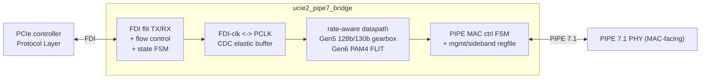

# ucie2-pipe7-bridge

RTL bridge from a **UCIe 2.0 FDI** (Flit-Aware Die-to-Die Interface,
controller-facing) to a **PCIe PIPE 7.1 MAC-facing** interface, verified by two
independently-authored, **cycle-accurate** testbenches (PyUVM-on-cocotb and
SystemVerilog UVM-on-Verilator).

> **Status:** Phase A scaffold. The DUT is a boundary shell (ports + idle
> defaults, no datapath yet); the environment — lint, both DV tiers, the
> cycle-accurate cross-check, container, and CI — is wired and green. The
> datapath is built in Phase B. See **`PLAN.md`** for the full plan and
> **`CLAUDE.md`** for session orientation.

## Architecture (target)



## Layout

| Path | What |
|------|------|
| `rtl/` | SystemVerilog RTL (bridge top + package) |
| `dv/pyuvm/` | PyUVM-on-cocotb tier (runs locally + CI) |
| `dv/uvm/{sv,vlt,vcs}/` | SV UVM env, Verilator `--binary` flow, VCS mirror |
| `dv/uvm/sv/ucie2_pipe7_sva.sv` | bound SVA checker on the bridge boundary (see below) |
| `dv/common/models/` | shared golden model + trace-format contract |
| `tools/trace_compare.py` | cycle-accurate PyUVM-vs-UVM trace diff |
| `tools/coverage_report.py` | `make coverage` line-coverage report (`[COV] line=NN.N%`) |
| `docs/` | spec cross-check, verification plan |
| `.devcontainer/`, `Dockerfile*`, `.railway/` | Codespaces, containers, Railway |

## Quick start (local, ~8 GB host)

```bash
make lint       # RTL strict lint (Verilator -Wall)
make pyuvm      # PyUVM-on-cocotb tier (needs a cocotb simulator on PATH)

# SV UVM env: LINT ONLY locally (the full --binary build OOMs a small box).
# Needs a UVM-capable Verilator >= 5.050 + its bundled UVM lib (NOT OSS CAD Suite):
make lint-uvm VERILATOR=~/verilator/bin/verilator \
              UVM_HOME=~/verilator/test_regress/t/uvm
```

The heavy gates run in **CI / the Railway container**, not locally:

```bash
make uvm            # full SV UVM --binary build + run   (CI/Railway)
make trace-compare  # cycle-accurate cross-check          (CI/Railway)
```

## Line coverage (advisory)

```bash
make coverage        # [COV] line=NN.N%  -> build/coverage/{coverage.txt,annotated/}
make coverage COV_MIN=80   # same, but fail below the floor (not enabled yet)
```

`make coverage` re-runs the **directed FDI round-trip** (`dv/pyuvm/test_roundtrip`)
in a *separate* Verilator `--coverage-line` build dir (`dv/pyuvm/cov_build`,
switched on only by `COVERAGE=1`) and scores it with `tools/coverage_report.py`:
per-instance points are merged by `(file, line)`, only `rtl/` sources count, and
branch points are reported separately (never part of the `line=` number).

It is **additive and outside the gate** — it is not run by `lint`/`pyuvm`/`fcov`/
`uvm`/`trace-compare`, and in CI it is a post-gate step in `uvm-verilator.yml`
(after `trace-compare`, `continue-on-error: true`), so it can never perturb the
byte-identical cross-check.

Measured baseline: **`[COV] line=63.3%` (38/60 RTL lines)**. The uncovered lines
are concentrated in `pipe7_msgbus_master.sv` and `pipe7_mac_ctrl_fsm.sv`, which
the loopback round-trip does not drive (the `make fcov` tier sweeps those). The
floor is **advisory (report only)** for now; a `>= NN%` gate is set via `COV_MIN`
once the baseline is agreed — deliberately *not* enabled in this change.

> If a cocotb build here dies with `ModuleNotFoundError: No module named
> 'encodings'`, that is a host quirk unrelated to this repo: cocotb exports
> `PYTHONHOME` for its embedded interpreter, which breaks the `/usr/bin/python3`
> that Verilator's `verilated.mk` hardcodes when the two are different versions.
> Work around it with `make pyuvm PYTHON3="$(command -v python3)"` (same for
> `make coverage`).

## Bound assertions (SVA)

`dv/uvm/sv/ucie2_pipe7_sva.sv` is a logic-free checker module `bind`-ed onto every
`ucie2_pipe7_bridge` instance — **no RTL edits**. It asserts, per cycle:

| Assertion | Property |
|-----------|----------|
| `a_no_tx_while_elec_idle` | `tx_data_valid` is never high while `tx_elec_idle` is asserted (qualified `!busy`) |
| `a_lock_is_sticky` | `block_locked` never drops without `sync_error` |
| `a_no_sync_error_once_locked` | no `sync_error` in steady state once `block_locked` |
| `a_stallreq_held_until_ack` | `pl_stallreq` is held until `lp_stallack` (or `lp_linkerror`) |
| `a_state_change_handshaked` | `pl_state_sts` only changes via a completed stall handshake |
| `a_no_rx_overflow` | `rx_overflow` never asserts in the directed round-trip |

It rides the existing SV UVM flow: `make lint-uvm` elaborates it and the CI/Railway
`make uvm` (`--binary`) **checks** it — `dv/uvm/vlt/Makefile` passes `--assert` and
fails the run on any `[SVA]` line in `obj/run.log`. It is intentionally **not** in
`rtl/`, so the root `make lint`, `make pyuvm` and `make fcov` source lists (which
glob `rtl/*.sv`) and the byte-identical cross-check trace are unaffected.

## Toolchain policy

This project **does not use OSS CAD Suite.** The reproducible environments
(`.devcontainer/`, `Dockerfile*`, CI) install apt `verilator`/`iverilog` for lint
and the PyUVM tier, and build a **UVM-capable Verilator ≥ 5.050 from source** for
the SV UVM `--binary` gate. Locally the Makefile takes `VERILATOR`/`IVERILOG`
overrides so it runs with whatever is on your PATH.

## Codespaces

`.devcontainer/devcontainer.json` builds `Dockerfile.dev` (apt tools + a
cocotb 1.x venv) and, on create, runs `make lint`. Run the PyUVM tier in the
Codespace with `make pyuvm` (the image ships a cocotb/Verilator combo that works
together — apt Verilator is 5.020, so cocotb is pinned to 1.x). Enable
**prebuilds** in the repo's Settings → Codespaces so a new Codespace starts with
the image and caches warm.

## Railway

`.railway/railway.ts` runs the SV UVM gate as a batch job (no listening port).
See `.railway/README.md`.
